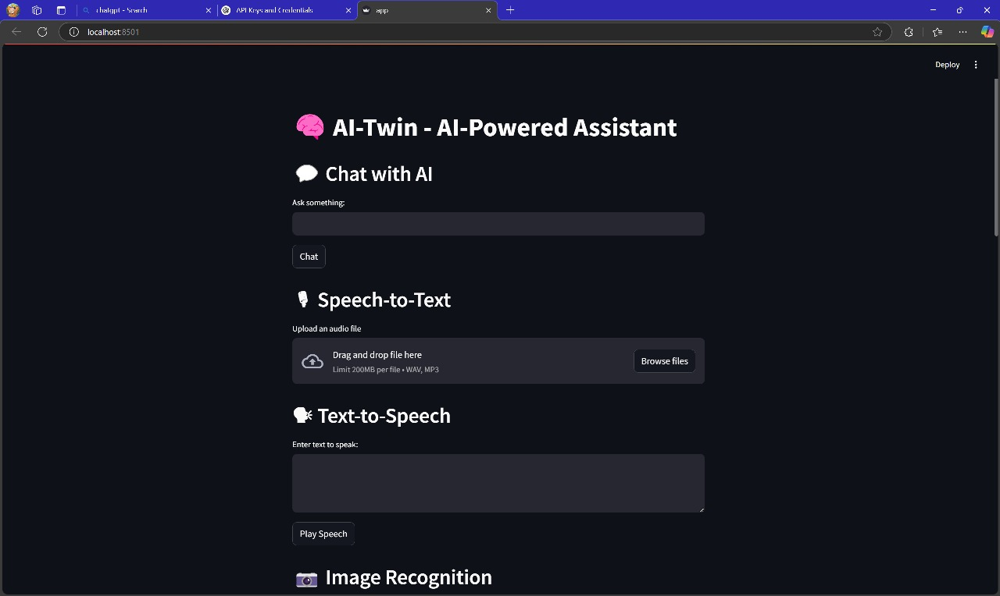
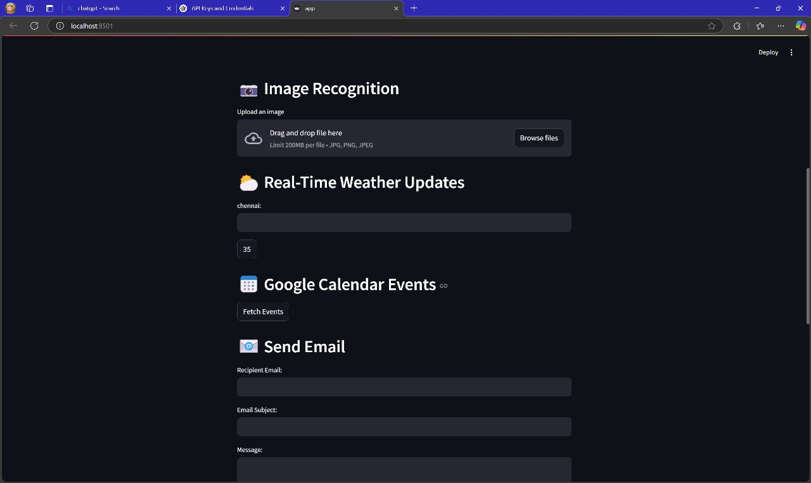
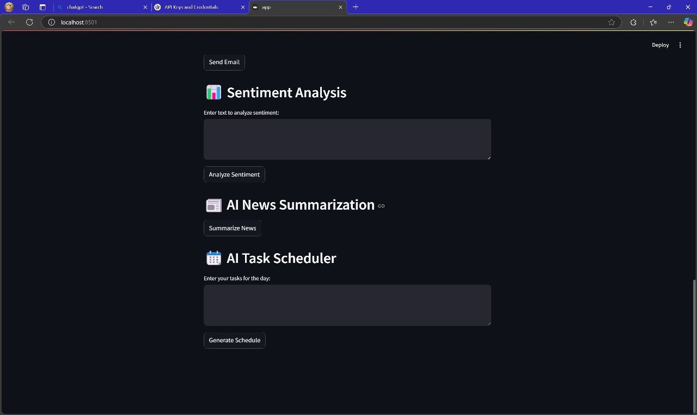

# AI-Twin: AI-Powered Digital Twin for Personalized Assistance and Predictive Decision-Making

AI-Twin is a smart assistant using AI and Machine Learning for personalized task automation and predictive decision-making. It features conversational AI, calendar integration, predictive analytics, and a user-friendly web interface.

---

## 💡 Features
- Conversational AI (Text + Voice)
- Predictive Task Management
- Calendar Event Reminders
- Real-Time Weather & Image Recognition
- Sentiment Analysis & News Summarization

---

## 🛠️ Build & Run Instructions

### 1. Clone the Repository
```bash
git clone https://github.com/MIRUDHULA-DHANARAJ/AI-DIGITAL-TWIN.git
cd AI-DIGITAL-TWIN

## 📸 Project Preview

### 🖥️ AI-Twin Interface (Chatbot View)


### 🗓️ Calendar Integration + Weather


### 🔍 Sentiment Analysis & News Summary


